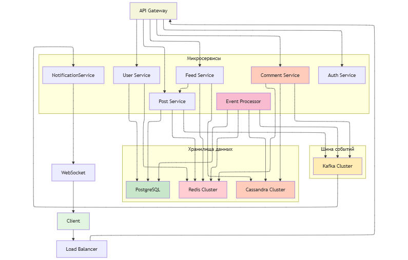
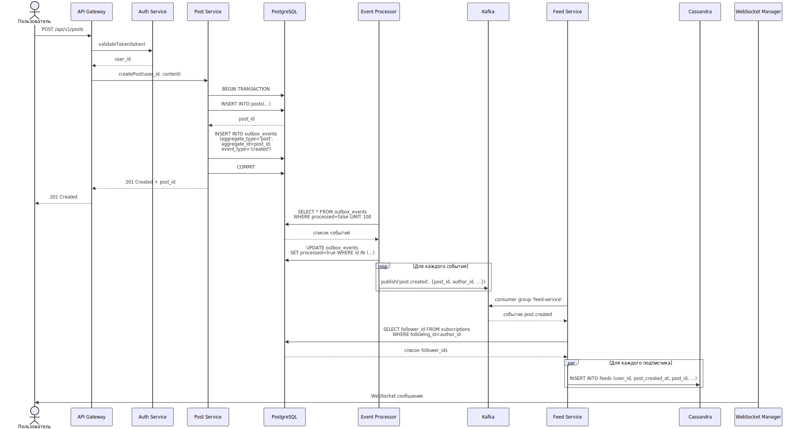
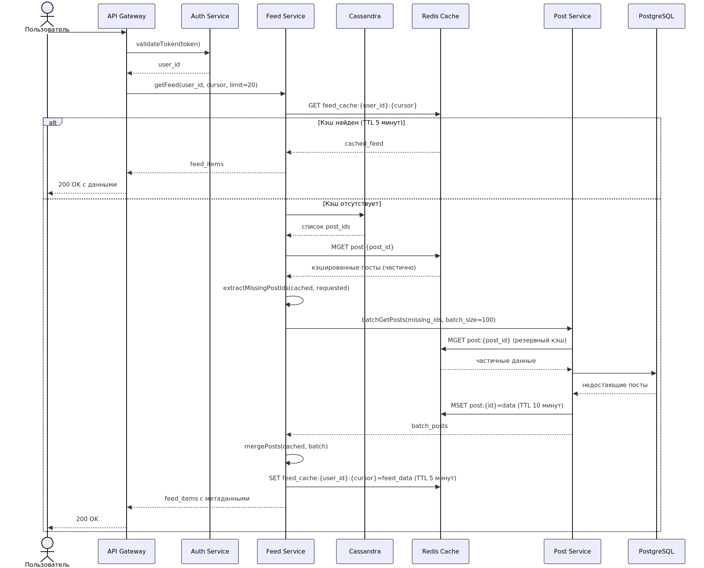
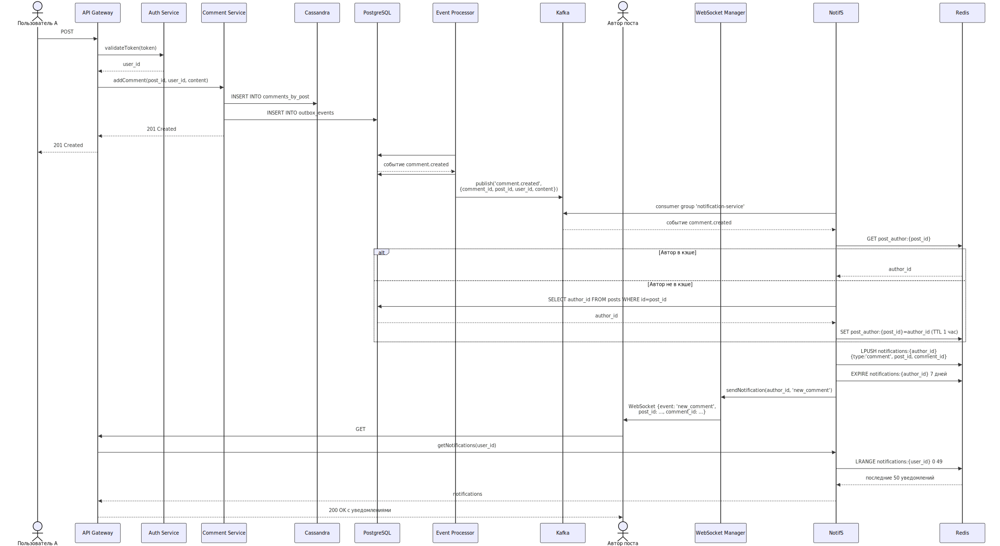
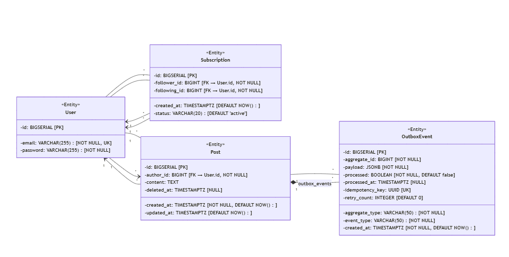

1. Оценочные расчеты

   Предположим, что у нас 100 млн пользователей и из их 10 млн пользователей активны каждый день.
   Ежедневно в системе появляется 20 млн новых постов. А к каждому посту в среднем идет по 10 комментариев.
   Т.е. 200 млн новых комментариев каждый день. В среднем человек подписан на 50 авторов.

   Итог RPS (суточные и пиковые):

         публикация постов - 20млн/(24*3600) = 230 запросов в секунду -> пик 2300 зап/сек
         доставка постов в ленты - 20млн*50/(24*3600) = 12тыс запросов в секунду -> 120тыс зап/сек
         чтение ленты (партии по 20) - 10млн*10/(24*3600) = 1200 -> 12тыс зап/сек
         запись/чтение комментариев - 
            запись - 200млн/(24*3600) = 2 300 запросов в секунду -> 23тыс зап/сек
            чтение - 10млн*20*10*0.5/(24*3600) = 12 тыс запросов в секунду -> 120 тыс зап/сек

   Оцените объём хранения на 1 и 3 года: посты (метаданные), индексы ленты, комментарии, кэш:

    - Допустим, пост занимает в среднем 1кб (текст + методанные) -> 20млн*100 байт = 20 гб в день под посты
      (7 тб за 1 год/ 21 тб за 3 года)
        - Индексы ленты (fan-out on write):
          16 байт (post_id + timestamp) * 20млн * 100 = 30 гб в день
        - Комментарии 1 кб * 20млн * 10 = 190 гб в день (66 тб в 1 год/ 198 тб в 3 года)
        - Кэш (последние 48 часов + реплика) 130 гб
                

   Хранение активной ленты (последние 1000 постов на пользователя):

   100M пользователей × 1000 записей × 16B = 1.6 ТБ

   За 3 года: 4.8 ТБ

   Заложите бюджет на рост в 3 раза без архитектурных изменений -> 4.8ТБ*3 = 14.4ТБ

2. Модель данных (логическая)

   **Схема таблицы `users`:**

   | Поле       | Тип                    | Описание      |
            |------------|------------------------|---------------|
   | `id`       | BIGSERIAL              | Идентификатор |
   | `email`    | VARCHAR(255) NOT NULL  | email         |
   | `password` | VARCHAR(255)  NOT NULL | Хэш пароля    |

   **Схема таблицы `subscriptions`:**

   | Поле            | Тип             | Описание                                                    |
            |-----------------|-----------------|-------------------------------------------------------------|
   | `id`            | BIGSERIAL       | Идентификатор                                               |
   | `follower_id`   | BIGINT NOT NULL | Подписчик, ссылка на таблицу users(id)                      | 
   | `following_id ` | BIGINT NOT NULL | Фвтор, на которого подписались, ссылка на таблицу users(id) |
   // констрейнт уникальность на пару (follower_id, following_id)

   **Схема таблицы `post`:**

   | Поле         | Тип                  | Описание                          |
            |--------------|----------------------|-----------------------------------|
   | `id`         | BIGSERIAL            | Идентификатор                     |
   | `author_id`  | BIGINT NOT NULL      | автор, ссылка на таблицу user(id) |
   | `content`    | TEXT                 |                                   |   
   | `created_at` | TIMESTAMPTZ NOT NULL | Дата создания                     |   

   **Схема таблицы `outbox_events`:**

   | Поле              | Тип                  | Описание                                         |
             |-------------------|----------------------|--------------------------------------------------|
   | `id`              | BIGSERIAL            | Первичный ключ, уникальный идентификатор события |
   | `aggregate_type`  | VARCHAR(50) NOT NULL | Тип агрегата (например, 'post', 'comment')       |
   | `aggregate_id`    | BIGINT NOT NULL      | Идентификатор конкретного экземпляра агрегата    |
   | `event_type`      | VARCHAR(50) NOT NULL | Тип события (например, 'created', 'updated')     |
   | `payload`         | JSONB NOT NULL       | Данные события в формате JSON                    |
   | `created_at`      | TIMESTAMPTZ NOT NULL | Время создания записи о событии                  |
   | `processed`       | BOOLEAN NOT NULL     | Флаг обработки события                           |
   | `idempotency_key` | UUID UNIQUE          | Уникальный ключ для обеспечения идемпотентности  |

   *Для таблицы создан индекс `idx_unprocessed (processed, created_at)` для эффективного выбора необработанных событий.*
   **Хранилище ленты** NoSql

   | Поле         | Описание      |
   |--------------|---------------|
   | `user_id`    | id получателя |
   | `post_id`    | id поста      |
   | `author_id`  | Хэш пароля    |
   | `created_at` | Дата создания |
   // От сортировано по дате создания

   **Комментарии** NoSql

   | Поле         | Описание           |
   |--------------|--------------------|
   | `post_id`    | id поста           |
   | `comment_id` | id коммента        |
   | `author_id`  | id автора коммента |
   | `created_at` | Дата создания      |
   | `content`    |                    | 
   // Отсортирован по дате создания

   **Кэш (Redis).**
    - post:{post_id} → JSON поста
    - user:{user_id} → JSON пользователя
    - feed:{user_id} → кэшированная страница ленты (TTL: 5 мин)
    - comments:{post_id}:latest → последние 50 комментариев (TTL: 1 мин)

3. Технические решения (сравнение и выбор)

   **Стратегия формирования ленты**
    * при чтении - формирование ленты при запросе пользователя

   | +                         | -                             |
            |---------------------------|-------------------------------|
   | Просто реализовывать      | Долгая ответ для пользователя |
   | Нет нужны и доп месте     |                               |
   | Всегда последние посты(?) |                               |
    * при записи - формирование ленты при записи поста в систему

   | +                      | -                                                               |
   |------------------------|-----------------------------------------------------------------|
   | Быстрое чтение         | Доп место под хранение                                          |
   | Предсказуемая нагрузка | Затраты на подсчет лент, которые возможно даже и не потребуются |
   |                        | Задержка доставки                                               |

   В моем понимании, для бизнеса важнее всего,
   чтобы пользователь максимально быстро "залип" в контент, а не рассматривал на спиннер,
   так что мой выбор `при записи`.

   **Пагинация для infinite scroll**
   Передается курсор, сервер читает партицию с ограничением. Курсор по факту представлет собой post_id+timestamp

   **Outbox/Transactional messaging**

   Паттерн для гарантированной доставки сообщений (в нашей ситуации постов).

   | +                        | -                         |
   |--------------------------|---------------------------|
   | Гарантия что пост дойдет | Задержка доставки поста   |
   |                          | Увеличение нагрузки на бд |

   Т.к. нам важно, чтобы каждый инфоповод дошел до своих подписчиков, то берем))

   **Идемпотентность и повторная доставка**

   При вставлении поста в ленту новостей к пользователям, проверяем нет ли такого уже в ленте.

   **Гидратация: порядок источников (кэш → сервис постов), размеры батчей, таймауты и деградация.**
   Размер батча - 20 постов.
   В начале запрашиваем без курсора
    1. Смотрим Redis
    2. Если в Redis достаточно данных:
        1. Поучаем id постов из Redis,
        2. Запрашиваем посты из сервиса постов
        3. Формируем ответ с курсором для следующей страницы
    3. Если в Redis мало данных:
        1. Берем данные из бд
        2. Асинхронно обновляем Redis

   Далее уже делаем запрос вместе с курсором:
    1. Распаршиваем курсор
    2. Запрашиваем данные из Redis
        1. Если данных достаточно - получаем посты и формируем новый курсор
        2. Если нет - запрашиваем данные в бд

   **Бэкап/восстановление и репликация для разных хранилищ.** TODO

    - PostgreSQL: Streaming replication, бекапы раз в день
    - Cassandra: Multi-DC репликация, ежедневные snapshots
    - Redis: RDB snapshots + AOF, репликация sentinel/cluster
    - Kafka: Replication factor 3, log retention 7 дней

4. Нарисуйте UML-диаграммы

   **Component / Container (уровень микросервисов, шина событий, хранилища, кэш).**
   
   **Sequence (три сценария):**

- публикация поста с Outbox и доставкой события;  
    
- чтение ленты с курсором и гидратацией;  
    
- комментарий → событие → WebSocket-уведомление.  
    

  **Deployment (узлы/контейнеры, масштабирование, внешние зависимости).**
    
  **Class/Data (логическая модель для реляционной части + стереотипы/примечания для нереляционной).**
    

  **Хранилище ленты** NoSql

  | Поле         | Описание |
  |--------------|----------|
  | `user_id`    | bigint   |
  | `post_id`    | bigint   |
  | `author_id`  | bigint   |
  | `created_at` | дата     |

  **Комментарии** NoSql

  | Поле         | Описание |
  |--------------|----------|
  | `post_id`    | bigint   |
  | `comment_id` | bigint   |
  | `author_id`  | bigint   |
  | `created_at` | Дата     |
  | `content`    | text     | 
  // Отсортирован по дате создания

Селебрити проблем (отобразить на сиквенсе)
N+1 проблема  - batch гидратация 
Прогретый кэш (ставится при запуске, отдельный кластер в редисе)

Потом приложить ссылку в таблицу 
